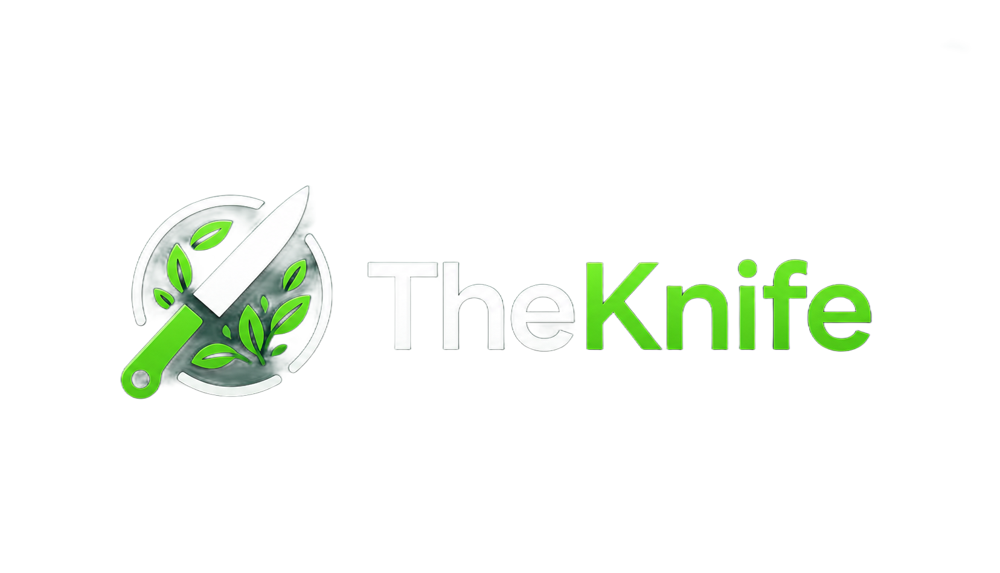

  

**Breve descrizione**: Questo è il progetto "theknife.TheKnife", un clone della famosa app TheFork come esercizio universitario

---

## 📌 **Indice**  

1. [Introduzione](#-introduzione)  
2. [Funzionalità](#-funzionalità)  
3. [Installazione](https://github.com/AmStanDem/TheKnife/tree/master?tab=readme-ov-file#%EF%B8%8F-installazione)  
4. [Utilizzo](https://github.com/AmStanDem/TheKnife/tree/master?tab=readme-ov-file#%EF%B8%8F-utilizzo)  

---

## 📜 **Introduzione** 

theknife.TheKnife è una piattaforma multifunzione che ha lo scopo di mettere in contatto clienti e ristoratori in modo intuitivo. Da un lato offre agli utenti la possibilità di scoprire ristoranti in tutto il mondo e selezionarli in base al luogo, alla tipologia culinaria, alla fascia di prezzo, e alla possibilità o meno di prenotare un tavolo o di ordinare da asporto. Dall’altro consente ai ristoratori di promuovere la propria attività o la propria catena di ristoranti inserendo le informazioni essenziali, ricevendo recensioni e dialogando direttamente con la clientela attraverso risposte pubbliche, favorendo così visibilità e miglioramento del servizio.

---

## ✨ **Funzionalità**

1. Modalità guest per permettere all'utente di visualizzare ristoranti vicini senza doversi registrare/login;
2. Una volta registrato, il cliente potrà mettere nella lista dei preferiti i ristoranti che gli sono piaciuti;
3. Il cliente può inserire recensioni e valutare i ristoranti e, in futuro, modificare o rimuovere le sue recensioni;
4. Il ristoratore può comodamente visualizzare tutte le recensioni e le medie di stelle dei suoi ristoranti;
5. Il ristoratore può rispondere alle recensioni lasciate dai clienti dei suoi ristoranti.

---

## ⚙️ **Installazione**  

### Requisiti

•	Java [Oracle Open JDK 24.0]
•	File eseguibile theknife.TheKnife.jar

### Avvio

Metodo 1. Avvio da terminale
  1.	Apri il prompt dei comandi (Windows) o il terminale (Linux/macOS).
  2.	Vai nella cartella dove si trova il file theknife.TheKnife.jar:
      cd /percorso/della/cartella
  3.	Avvia il programma con: 
      java -jar theknife.TheKnife.jar
    	
Metodo 2. Avvio tramite interfaccia grafica
  1.	Vai nella cartella dove si trova il file theknife.TheKnife.jar
  2.	Fai click destro sul file 
  3.	Seleziona Apri con -> Java (oppure Java(TM) Platform SE binary)

---

## 🖥️ **Utilizzo**

📒 **Manuale utente**

🔧 **Manuale tecnico**

